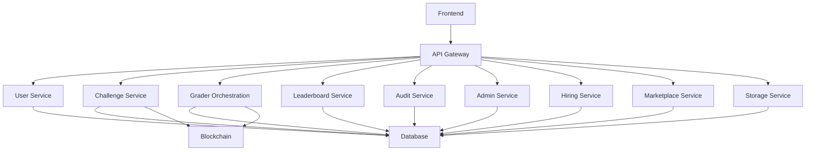

# 🧠 FATHUSS — The Ultimate Web3 Coding Challenge Platform

A next‑generation **Web3 LeetCode** designed for smart contract developers, blockchain engineers, and Web3 learners. Fathuss brings together **coding challenges, gas-optimization battles, real‑time leaderboards, AI code evaluation, on‑chain submissions, decentralized profiles**, and professional Web3 interview preparation.

---

## 🚀 Vision

Fathuss empowers millions of developers to master blockchain development through:

* Real-time smart contract challenges
* Automatic gas usage scoring
* On‑chain verification of solutions
* AI-powered code reviews
* Global leaderboards
* Web3-native identity

---

## 🌐 Core Features

### 1. **User Authentication**

* Wallet login (MetaMask, WalletConnect, Coinbase Wallet)
* Email/Social optional login
* SIWE (Sign-In With Ethereum)

### 2. **Challenge Engine**

* Smart contract challenges (Solidity, Vyper, Move)
* Testcases generated on-chain/off-chain
* Gas scoring system
* Difficulty tiers

### 3. **On‑Chain Execution Layer**

* Sandbox EVM for isolated execution
* Real-time compilation + execution
* Deployed contracts hashed and stored
* Proof-of-completion NFTs

### 4. **AI Code Engine**

* Explains errors
* Recommends optimizations
* Detects vulnerabilities (reentrancy, overflow, griefing)
* Assigns quality score

### 5. **Leaderboards**

* Global leaderboard
* Friends leaderboard
* Gas optimization leaderboard
* Weekly tournaments

### 6. **User Profiles**

* XP levels
* Completed challenges
* NFTs earned
* On-chain badges

### 7. **Admin Panel**

* Add/update challenges
* Testcase management
* Ban/remove cheating attempts

---

## 🏗️ System Architecture

### **Frontend (Next.js 15 + React 19)**

* Wallet connection (wagmi, viem)
* Realtime sandbox execution UI
* Monaco editor for code
* Tailwind + shadcn/ui UI system

### **Backend (Node.js / NestJS)**

* Challenge API
* Testcase generation
* AI explanation service
* XP & leaderboard computation

### **Blockchain Layer**

* Solidity challenge contracts
* Challenge completion proof NFTs
* Gas scoreboard smart contract

### **Database**

* PostgreSQL + Prisma
* Redis queue for execution tasks
* Supabase Storage (optional decentralized pinning)

### **Execution Layer**

* EVM sandbox (Foundry / Hardhat / Tenderly)
* Secure code runner
* Gas measurement system

### Architecture Diagram



---

## 🛠️ Tech Stack

| Layer      | Technologies                                                 |
| ---------- | ------------------------------------------------------------ |
| Frontend   | Next.js, React, Tailwind, TypeScript, Wagmi, Viem, shadcn/ui |
| Backend    | Node.js, NestJS, Prisma, PostgreSQL, Redis                   |
| Blockchain | Solidity, Hardhat, Foundry, Tenderly                         |
| AI Engine  | GPT-based code evaluator, linting, optimization analyzer     |
| Deployment | Vercel + Railway/Render + Infura/Alchemy                     |

---

## 📦 Folder Structure

```
fathuss/
├── frontend/
│   ├── pages/
│   ├── components/
│   ├── hooks/
│   ├── utils/
│   └── public/
├── backend/
│   ├── src/
│   ├── modules/
│   ├── prisma/
│   └── tests/
├── smart-contracts/
│   ├── challenges/
│   ├── scripts/
│   └── deployments/
└── docs/
    └── architecture.md
```

---

## 🚦 Installation

### 1. Clone

```
git clone https://github.com/YOUR_USERNAME/fathuss.git
cd fathuss
```

### 2. Install dependencies

```
cd frontend && npm install
cd ../backend && npm install
cd ../smart-contracts && npm install
```

### 3. Environment setup

Create `.env` files for:

* frontend
* backend
* smart-contracts

### 4. Run

```
# Frontend
device:~ frontend npm run dev

# Backend
backend npm run start:dev

# Smart Contracts
smart-contracts npx hardhat test
```

---

## 🧪 Testing Engine

* Unit tests
* Integration tests
* Gas profiling tests
* On-chain deployment tests

---

## 🛡️ Security

* Automatic reentrancy scan
* AI-based vulnerability detection
* Contract safety score
* Secure execution sandbox

---

## 🗺️ Roadmap

### Phase 1 — Foundation (DONE)

### Phase 2 — Auth & Profiles

### Phase 3 — Challenge Engine

### Phase 4 — On-chain Execution

### Phase 5 — AI Engine

### Phase 6 — Leaderboards

### Phase 7 — Monetization + Tournament Mode

---

## 🤝 Contributions

Pull requests welcome.

---

## 📄 License

MIT

---

## 🔥 Contact

Built by Jagadeesh — the creator of **Fathuss**.

For Web3, blockchain engineering, and architecture support — drop a message anytime.