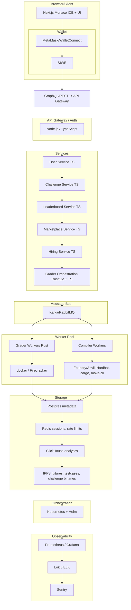

# Fathuss 🚀

**Web3-Native, Multi-Chain Challenge Platform**  
*CTF + Learning + Hiring + Grader*

[](LICENSE)
[](https://nodejs.org/)
[](https://soliditylang.org/)

Fathuss is a cutting-edge platform designed for Web3 enthusiasts, developers, and organizations to engage in Capture The Flag (CTF) challenges, continuous learning, talent hiring, and automated grading across multiple blockchain networks.

## 🛠️ Technology Stack

### Frontend
- **TypeScript + Next.js + React + Monaco Editor**

### Backend API
- **TypeScript (Node.js / NestJS or tRPC)** for core services

### Grader / Worker
- **Rust** (for safety/perf) or Go as alternative

### Smart Contracts & Tooling
- **Solidity (Foundry + Forge + Anvil), Hardhat, Slither, Echidna**

### Other Chains
- **Solana (Rust), Move (Aptos/Sui), BPF toolchain**

### Containers
- **Docker**; microVMs (Firecracker) optional for extra isolation

### Orchestration
- **Kubernetes**

### Database
- **PostgreSQL** (primary), **Redis** (cache/locks), **ClickHouse** (analytics)

### Storage
- **IPFS** (NFT.Storage / Web3.Storage) + S3 as fallback

### Messaging
- **Kafka or RabbitMQ**

### Authentication
- **SIWE, GitHub OAuth, optional email login**

### CI/CD
- **GitHub Actions / GitLab CI + ArgoCD** for K8s deploys

## 🏗️ Architecture

Fathuss is a distributed platform with three main user-facing surfaces and several backend subsystems:

### Component Diagram



### Security & Resource Enforcement

Fathuss implements comprehensive security measures and resource controls to ensure safe execution of user-submitted code:

#### Sandboxing & Isolation
- **Containerized Execution**: All code execution happens in isolated Docker containers
- **Process Isolation**: Each execution runs in its own process with restricted privileges
- **Network Isolation**: Containers run with disabled networking by default

#### Resource Limits
- **CPU Control**: Cgroups limit CPU usage with configurable shares and quotas
- **Memory Limits**: Strict memory limits enforced via cgroups to prevent OOM attacks
- **Disk Quotas**: Ephemeral volumes use tmpfs with size limits to control disk usage
- **Process Limits**: Maximum number of processes per execution is restricted

#### Timeouts & Safety
- **Execution Timeouts**: Configurable timeouts for compilation and test execution phases
- **File Size Limits**: Maximum file sizes enforced to prevent disk fill attacks
- **Privilege Dropping**: Processes run with minimal privileges (nobody user when possible)

### User-Facing Surfaces
- **User Web App (Frontend)**: Challenge browsing, in-browser IDE, user profiles, leaderboards, and community features
- **Author/Admin Dashboard**: Create and manage challenges, tests, hints, versions, and moderation tools
- **Judge/Grader Platform**: Secure sandboxed execution environment for compiling, running, and grading submissions across multiple chains (EVM, Solana, Move)

### Supporting Systems
- **Authentication & Identity**: SIWE (Sign-In with Ethereum) + OAuth integration
- **Persistence**: Postgres + Redis + ClickHouse for data storage and analytics
- **Storage**: IPFS for decentralized and scalable file storage
- **Messaging & Queue**: RabbitMQ for asynchronous processing
- **Orchestration**: Docker + optional Firecracker microVMs for containerization and scaling
- **Observability & Security**: Comprehensive monitoring, logging, and security measures

## 🗄️ Storage Architecture

Fathuss implements a comprehensive multi-tier storage architecture designed for scalability, performance, and reliability:

### Storage Layer Components

#### PostgreSQL (Port 5432) - Primary Database
**Purpose**: Structured data storage and relationships
- User profiles, challenges, submissions, marketplace items
- ACID compliance for transactional data
- Complex queries and full-text search

#### Redis (Port 6379) - Caching & Sessions
**Purpose**: High-performance caching and session management
- User sessions with automatic expiration
- API rate limiting counters
- Frequently accessed data caching

#### ClickHouse (Port 8123) - Analytics Database
**Purpose**: Real-time analytics and metrics aggregation
- User activity events and challenge completion metrics
- API usage statistics and file operation analytics
- Column-oriented storage for analytical queries

#### IPFS (Port 5001) - Decentralized File Storage
**Purpose**: Permanent, distributed file storage
- Challenge test cases, fixtures, and binaries
- User-uploaded content and static assets
- Content-addressed storage with global distribution

### Storage Service (Port 4007)
Central coordination service managing all storage operations:
- IPFS file upload/download orchestration
- Analytics data aggregation
- Cache management and session handling
- File metadata management

## 🌟 Features

- **Multi-Chain Support**: Deploy and run challenges on Ethereum, Polygon, Arbitrum, and more
- **CTF Challenges**: Interactive cybersecurity and smart contract vulnerability challenges
- **Learning Modules**: Structured courses and tutorials for Web3 development
- **Hiring Platform**: Connect talent with opportunities through skill-based assessments
- **Automated Grader**: Real-time evaluation of submissions with detailed feedback
- **Web3-Native**: Built for decentralized technologies with wallet integration

## 🚀 Quick Start

### Prerequisites
- Node.js 18+
- npm or yarn
- MetaMask or compatible Web3 wallet

### Installation

```bash
git clone https://github.com/Podamekalajagadeesh/Fathuss.git
cd Fathuss
npm install
npm run api:install  # Install API Gateway dependencies
```

### Environment Setup

Create a `.env.local` file in the root directory and add the following:

```env
NEXT_PUBLIC_WALLETCONNECT_PROJECT_ID=your_walletconnect_project_id
NEXT_PUBLIC_API_GATEWAY_URL=http://localhost:4000
```

Create a `.env` file in the `api-gateway` directory and add:

```env
JWT_SECRET=your-jwt-secret-key
GITHUB_CLIENT_ID=your-github-client-id
GITHUB_CLIENT_SECRET=your-github-client-secret
GITHUB_CALLBACK_URL=http://localhost:4000/auth/github/callback
FRONTEND_URL=http://localhost:3000
```

Get your WalletConnect Project ID from [WalletConnect Cloud](https://cloud.walletconnect.com/).

For GitHub OAuth, create an OAuth App at [GitHub Developer Settings](https://github.com/settings/developers) and set the callback URL to `http://localhost:4000/auth/github/callback`.

### Running the Platform

1. Install all dependencies:
```bash
npm install
npm run api:install
npm run services:install
```

2. Start the API Gateway:
```bash
npm run api:dev
```

3. In another terminal, start all services:
```bash
npm run services:dev
```

4. In a third terminal, start the frontend:
```bash
npm run dev
```

### Running with Docker

For a complete development environment with all services:

```bash
docker-compose up --build
```

This will start all services with their dependencies (PostgreSQL, Redis, ClickHouse, IPFS).

After starting the services, initialize the databases:

```bash
./init-databases.sh
```

## ☸️ Kubernetes Orchestration

Fathuss provides complete Kubernetes orchestration using Helm charts for production deployment.

### Prerequisites
- Kubernetes cluster (1.19+)
- Helm 3.0+
- kubectl configured to access your cluster

### Quick Deployment

1. Clone and navigate to the repository:
```bash
git clone https://github.com/Podamekalajagadeesh/Fathuss.git
cd Fathuss
```

2. Deploy using the provided script:
```bash
chmod +x deploy-k8s.sh
./deploy-k8s.sh
```

Or deploy manually:
```bash
# Add required Helm repositories
helm repo add bitnami https://charts.bitnami.com/bitnami
helm repo update

# Create namespace
kubectl create namespace fathuss

# Install Fathuss
helm install fathuss ./k8s/helm -n fathuss
```

### Helm Chart Features

- **Complete Service Deployment**: All microservices with proper health checks and resource limits
- **Database Management**: PostgreSQL, Redis, ClickHouse with persistent volumes
- **IPFS Integration**: Decentralized file storage with cluster networking
- **Ingress Configuration**: NGINX ingress with SSL termination
- **Network Policies**: Security policies for service communication
- **Horizontal Pod Autoscaling**: Auto-scaling based on CPU/memory usage
- **Secrets Management**: Secure configuration using Kubernetes secrets

### Customizing Deployment

Override default values:

```bash
helm install fathuss ./k8s/helm -n fathuss \
  --set apiGateway.replicas=3 \
  --set postgresql.persistence.size=50Gi \
  --set ingress.hosts[0]=api.yourdomain.com
```

### Monitoring Deployment

```bash
# Check deployment status
kubectl get all -n fathuss

# View logs
kubectl logs -f deployment/fathuss-api-gateway -n fathuss

# Port forward for local access
kubectl port-forward svc/fathuss-api-gateway 4000:4000 -n fathuss
```

### Service Ports (Kubernetes)
- **API Gateway**: 80/443 (via Ingress)
- **Frontend**: 80/443 (via Ingress)
- **IPFS Gateway**: ClusterIP service
- **Databases**: Internal cluster access only

### Production Considerations

- Configure external DNS for ingress hosts
- Set up SSL certificates (cert-manager recommended)
- Configure persistent volume storage classes
- Set up monitoring stack (Prometheus/Grafana)
- Configure backup strategies for databases
- Implement proper RBAC and network policies

### Service Ports
- **API Gateway**: 4000
- **User Service**: 4001
- **Challenge Service**: 4002
- **Leaderboard Service**: 4003
- **Marketplace Service**: 4004
- **Hiring Service**: 4005
- **Grader Orchestration**: 4006
- **Storage Service**: 4007
- **PostgreSQL**: 5432
- **Redis**: 6379
- **ClickHouse HTTP**: 8123
- **IPFS API**: 5001, **Gateway**: 8080

## 📚 Documentation

- [Getting Started Guide](./docs/getting-started.md)
- [Challenge Creation](./docs/challenge-creation.md)
- [API Reference](./docs/api.md)
- [CI/CD Strategy](./docs/CICD_STRATEGY.md)

## ⚖️ Legal & Compliance

- [Terms of Service](./docs/TERMS_OF_SERVICE.md)
- [Data Retention Policy](./docs/DATA_RETENTION_POLICY.md)
- [GDPR Compliance](./docs/GDPR_COMPLIANCE.md)
- [DMCA Takedown Process](./docs/DMCA_TAKEDOWN.md)

## 🤝 Contributing

We welcome contributions! Please see our [Contributing Guidelines](./CONTRIBUTING.md) for details.

1. Fork the repository
2. Create your feature branch (`git checkout -b feature/AmazingFeature`)
3. Commit your changes (`git commit -m 'Add some AmazingFeature'`)
4. Push to the branch (`git push origin feature/AmazingFeature`)
5. Open a Pull Request

## 📄 License

This project is licensed under the MIT License - see the [LICENSE](./LICENSE) file for details.

## 🌐 Connect

- [Website](https://fathuss.com)
- [Discord](https://discord.gg/fathuss)
- [Twitter](https://twitter.com/fathuss)

---

*Empowering the next generation of Web3 developers through challenges and innovation.*